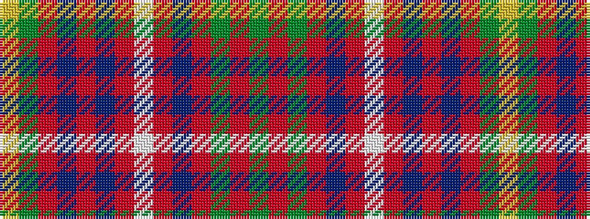

GRGRBRWRBRBRGY

It is a 14 stripe tartan.

<figure class="pat-woven">

<figcaption>idealised sample</figcaption>
</figure>

## Colour Sequence



## Tartans with this colour sequence

| Tartans |
|---------------|
| [Recycled Lamb, The](/variants/s14/g15r1g8m3dp1m3w1m3dp1m3dp12r1g7ly1~x2/)|
||
| [Recycled Lamb, The](/variants/s14/g15r1g8r3dp1r1w1r3dp1r3dp12r1g7ly1~x2/)|
||
