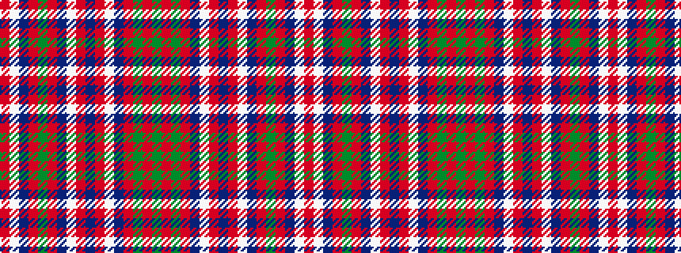

GRGRBWRBRWBRGRBWR

It is a 17 stripe tartan.

<figure class="pat-woven">

<figcaption>idealised sample</figcaption>
</figure>

## Colour Sequence



## Tartans with this colour sequence

| Tartans |
|---------------|
| [Dalzell](/setts/s17/r24w1db2r8g52r8db2w1r8db12r8w1db2r52g4ri6g6~x2/)|
||
| [Dalzell](/setts/s17/r24lb1db2r4dg32r4db2lb1r4db6r4lb1db2r32dg2r3dg6~x2/)|
||
| [Dalziel](/setts/s17/r40w2db1r3g31r3db1w2r3db8r3w2db1r34g4r4g4~x2/)|
||
| [Dalziel](/setts/s17/r24w1db2r4g32r4db2w1r4db6r4w1db2r32g2ri3g6~x2/)|
||
| [Dalziel #1](/setts/s17/r40w2db1r3dg31r3db1w2r3db8r3w2db1r34dg4r4dg4~x2/)|
||
| [Dalziel #2](/setts/s17/r24w1dp2r4g32r4dp2w1r4dp6r4w1dp2r32g2ri3g6~x2/)|
||
| [Dalziel (Clan)](/setts/s17/r24w1dp2r4g32r4dp2w1r4dp6r4w1dp2r32g6ri6g6~x2/)|
||
| [Dalziel (Logan) Family Tartan Tartan Number: 969. Earliest known date: 1831 Dalziel or Dalzell tartan is similar to the Munro. The basic form of the design was used for a 'George IV' tartan produced in honour of the King's visit in 1822. The Barony of Dalzell in Lanarkshire is the origin of the name. In Old Scots it means 'I dare' and this is also the motto on the family coat of arms. A cadet branch of the family built the House of the Binns in West Lothian which is now owned by the National Trust for Scotland. See products available Copyright © Blair Urquhart, Comrie, 2015](/setts/s17/r24w1db2r4g32r4db2w1r4db6r4w1db2r32g2m3g6~x2/)|
|![Dalziel (Logan) Family Tartan Tartan Number: 969. Earliest known date: 1831 Dalziel or Dalzell tartan is similar to the Munro. The basic form of the design was used for a 'George IV' tartan produced in honour of the King's visit in 1822. The Barony of Dalzell in Lanarkshire is the origin of the name. In Old Scots it means 'I dare' and this is also the motto on the family coat of arms. A cadet branch of the family built the House of the Binns in West Lothian which is now owned by the National Trust for Scotland. See products available Copyright © Blair Urquhart, Comrie, 2015 example sett](/setts/s17/r24w1db2r4g32r4db2w1r4db6r4w1db2r32g2m3g6~x2/sett.png)|
