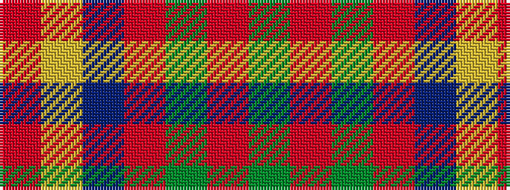

GRGRBYR

It is a 7 stripe tartan.

<figure class="pat-woven">

<figcaption>idealised sample</figcaption>
</figure>

## Colour Sequence



## Tartans with this colour sequence

| Tartans |
|---------------|
| [Strange Of Balcaskie](/variants/s7/g32o7g7o16db32ly3o8~x2/)|
||
