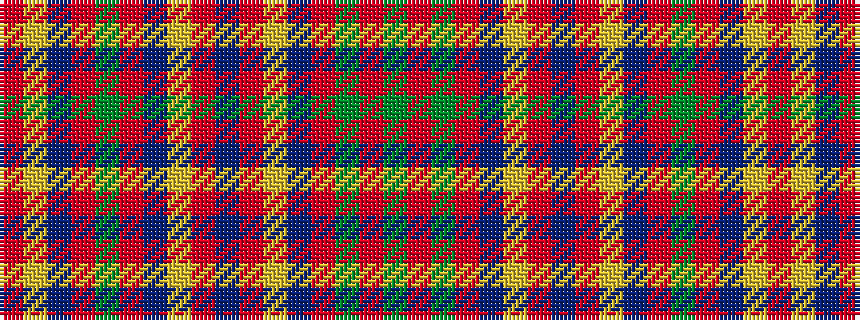

GRGRBYRBRYBRGRBYR

It is a 17 stripe tartan.

<figure class="pat-woven">

<figcaption>idealised sample</figcaption>
</figure>

## Colour Sequence



## Tartans with this colour sequence

| Tartans |
|---------------|
| [Lochiel (Cameron)](/variants/s17/r36ly2dp1r3g41r3dp1ly2r3dp12r3ly2dp1r37g3ri3g4~x2/)|
||
| [Munro](/setts/r24ly1db1r3g16r3db1ly1r3db6r3ly1db1r16g2ri2g2/)|
||
| [Munro](/variants/s17/r24ly1db1r3dg16r3db1ly1r3db6r3ly1db1r16dg2r2dg2~x2/)|
||
| [Munro (Clan)](/variants/s17/r36ly2db1r3g41r3db1ly2r3db12r3ly2db1r36g3ri3g4~x2/)|
||
| [Munro (Logan)](/variants/s17/r19ly1db1r2g18r2db1ly1r2db4r2ly1db1r19g2r2g2~x2/)|
||
| [Munro Clan Tartan](/variants/s17/r24ly1db1r3g16r3db1ly1r3db6r3ly1db1r16g2m2g2~x2/)|
||
