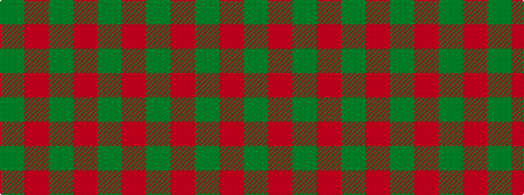

GRGRG

It is a 5 stripe tartan.

<figure class="pat-woven">

<figcaption>idealised sample</figcaption>
</figure>

## Colour Sequence



## Tartans with this colour sequence

| Tartans |
|---------------|
| [MacGregor of Glen Strae](/variants/s5/g8r2g9r16g1~x2/)|
||
| [MacGregor of Glenstrae](/variants/s5/dg8r2dg9r16dg1~x2/)|
||
