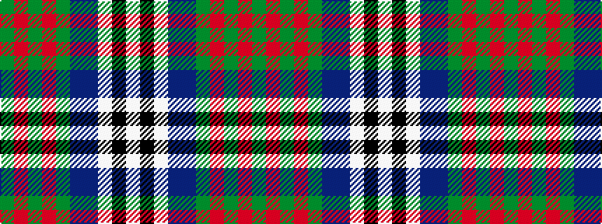

GRGRGBBWKW

It is a 10 stripe tartan.

<figure class="pat-woven">

<figcaption>idealised sample</figcaption>
</figure>

## Colour Sequence



## Tartans with this colour sequence

| Tartans |
|---------------|
| [Scotland the Brave Dress (Dance)](/variants/s10/w3k1w20dp1db6g6m3g1m1g2~x4/)|
||
