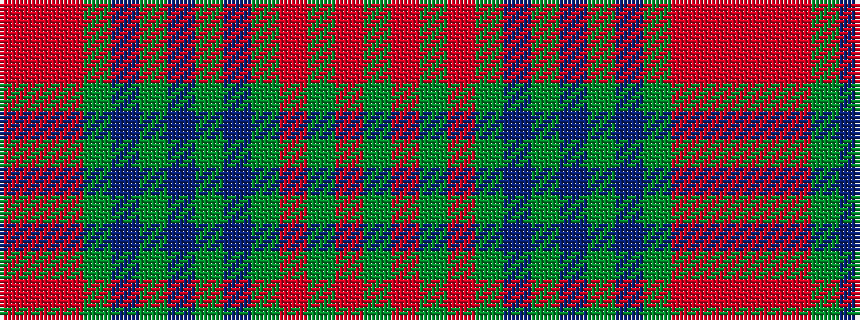

GRGRGBGBGBGRRR

It is a 14 stripe tartan.

<figure class="pat-woven">

<figcaption>idealised sample</figcaption>
</figure>

## Colour Sequence



## Tartans with this colour sequence

| Tartans |
|---------------|
| [Allen - Northumbrian Hunting (Personal)](/setts/s14/dy16o2dy3o4dy2n12dy18n2dy18n12dy12o2o2o2~x2/)|
||
