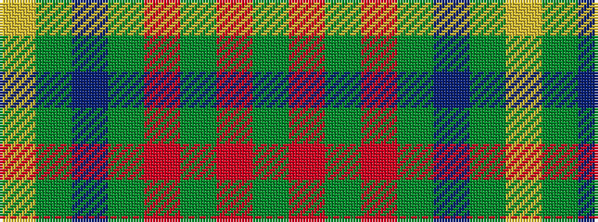

GRGRGBGY

It is a 8 stripe tartan.

<figure class="pat-woven">

<figcaption>idealised sample</figcaption>
</figure>

## Colour Sequence



## Tartans with this colour sequence

| Tartans |
|---------------|
| [Glen Esk](/setts/s8/dg10r1dg1r2dg8db10dg1ly1~x4/)|
||
| [Glen Nevis #1](/setts/s8/dg8r2dg2r3dg8db12dg2lo2~x2/)|
||
| [Glen Nevis #1 (Fashion)](/setts/s8/dg8r2dg2r3dg8db12dg2ly2~x2/)|
||
