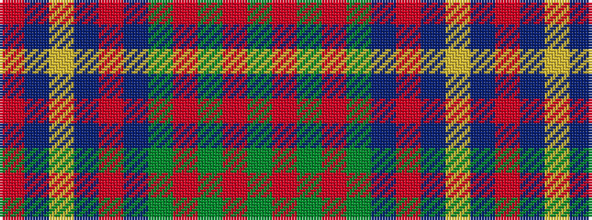

GRGRGBRBYBR

It is a 11 stripe tartan.

<figure class="pat-woven">

<figcaption>idealised sample</figcaption>
</figure>

## Colour Sequence



## Tartans with this colour sequence

| Tartans |
|---------------|
| [Commonwealth Games 1998](/setts/s11/dg10m2dg2r4dg16dp16r2t18lo2t8r3~x2/)|
||
| [Commonwealth Games 1998 (Corporate)](/setts/s11/g10m2g2mi4g16dp16mi2t18lo2t8mi3~x2/)|
||
