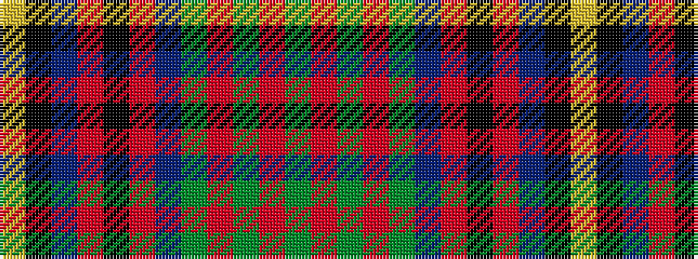

GRGRGBRKRBKY

It is a 12 stripe tartan.

<figure class="pat-woven">

<figcaption>idealised sample</figcaption>
</figure>

## Colour Sequence



## Tartans with this colour sequence

| Tartans |
|---------------|
| [Kelsey, William (Personal)](/variants/s12/g12r2g2r5g16db3o2k2o3db6k20ly3~x2/)|
||
