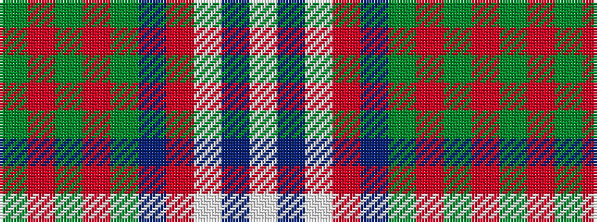

GRGRGBRWBW

It is a 10 stripe tartan.

<figure class="pat-woven">

<figcaption>idealised sample</figcaption>
</figure>

## Colour Sequence



## Tartans with this colour sequence

| Tartans |
|---------------|
| [Clyde](/setts/s10/lb4n2lb18r2n5y16r2y2r2y2~x2/)|
||
