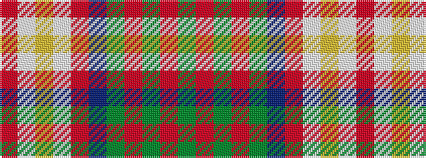

GRGRGBRWYWR

It is a 11 stripe tartan.

<figure class="pat-woven">

<figcaption>idealised sample</figcaption>
</figure>

## Colour Sequence



## Tartans with this colour sequence

| Tartans |
|---------------|
| [Unidentified (Woven sample)](/setts/s11/g18r4g4r6g28dp28r4lt3ly4lt13r6/)|
||
