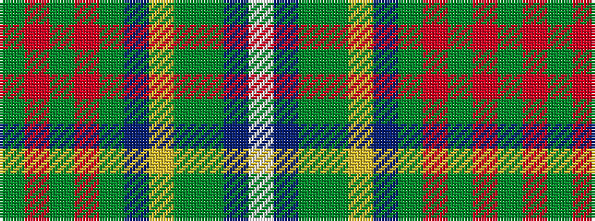

GRGRGBYGGBW

It is a 11 stripe tartan.

<figure class="pat-woven">

<figcaption>idealised sample</figcaption>
</figure>

## Colour Sequence



## Tartans with this colour sequence

| Tartans |
|---------------|
| [Porcupine](/variants/s11/y1r1y3o1y1dr8ly7g1y1t1w1~x2/)|
||
