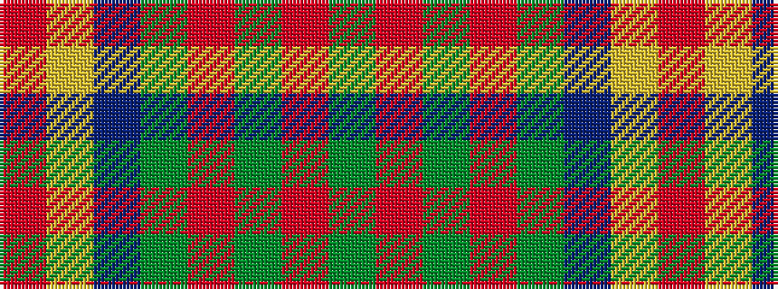

GRGRGBYR

It is a 8 stripe tartan.

<figure class="pat-woven">

<figcaption>idealised sample</figcaption>
</figure>

## Colour Sequence



## Tartans with this colour sequence

| Tartans |
|---------------|
| [Leatherneck U.S.Marine Corps Corporate Tartan Tartan Number: 975. Earliest known date: 1986 Designed by Madam Leask and the Scottish Tartans Society Accredited in 1981. See products available Copyright © Blair Urquhart, Comrie, 2015](/setts/s8/g28r2g2r2g8db24ly3r2~x2/)|
||
| [U.S. Marine Corps (Military?)](/setts/s8/dg40r3dg4r3dg12db32ly4r3~x2/)|
||
| [US Marine Corps](/setts/s8/g40r3g4r3g12db32lo4r3~x2/)|
||
