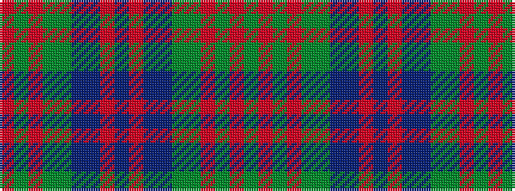

GRGRGGBBRBRBBGGRGR

It is a 18 stripe tartan.

<figure class="pat-woven">

<figcaption>idealised sample</figcaption>
</figure>

## Colour Sequence



## Tartans with this colour sequence

| Tartans |
|---------------|
| [Stewart of Appin Hunting](/setts/s18/g8r3g3r5g26dy7t3db28r3db6~x2/)|
||
