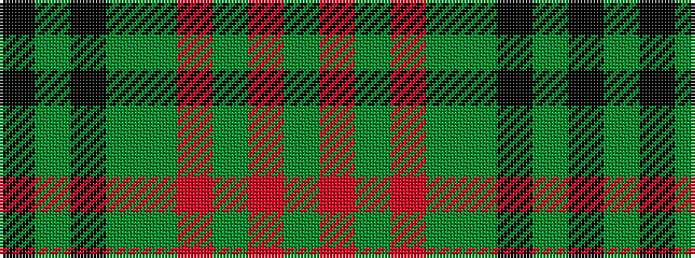

GRGRGGKGK

It is a 9 stripe tartan.

<figure class="pat-woven">

<figcaption>idealised sample</figcaption>
</figure>

## Colour Sequence



## Tartans with this colour sequence

| Tartans |
|---------------|
| [Historic Scotland Corporate Tartan](/variants/s9/k2y7k1y9dy21o2dy1o1dy2~x2/)|
||
