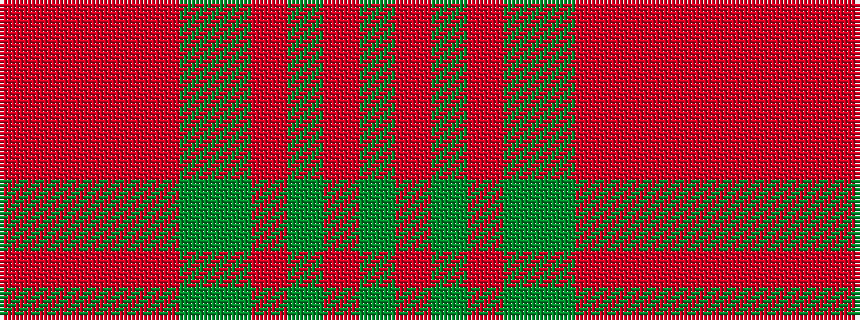

GRGRGGRRRRR

It is a 11 stripe tartan.

<figure class="pat-woven">

<figcaption>idealised sample</figcaption>
</figure>

## Colour Sequence



## Tartans with this colour sequence

| Tartans |
|---------------|
| [Glenmorangie #2](/setts/s11/dyi6m2dyi2m4dyi13dy12o13m4o2m2o6~x2/)|
||
