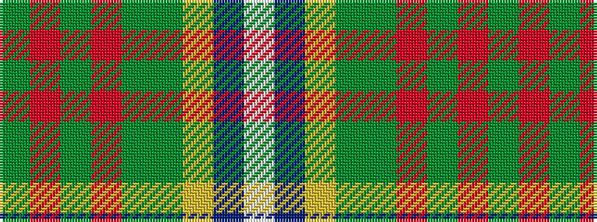

GRGRGGYBW

It is a 9 stripe tartan.

<figure class="pat-woven">

<figcaption>idealised sample</figcaption>
</figure>

## Colour Sequence



## Tartans with this colour sequence

| Tartans |
|---------------|
| [Derry Family (Olney, Buckinghamshire) (Personal)](/setts/s9/w6b36ly12dy19dy6r6dy6r28dy4/)|
||
| [Derry Family (Personal)](/setts/s9/w6t36lo12g19g6r6g6r28g4/)|
||
