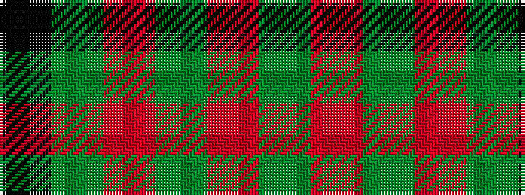

GRGRGK

It is a 6 stripe tartan.

<figure class="pat-woven">

<figcaption>idealised sample</figcaption>
</figure>

## Colour Sequence



## Tartans with this colour sequence

| Tartans |
|---------------|
| [St. David's (District)](/variants/s6/dg60r2dg8r1dg5k2/)|
||
