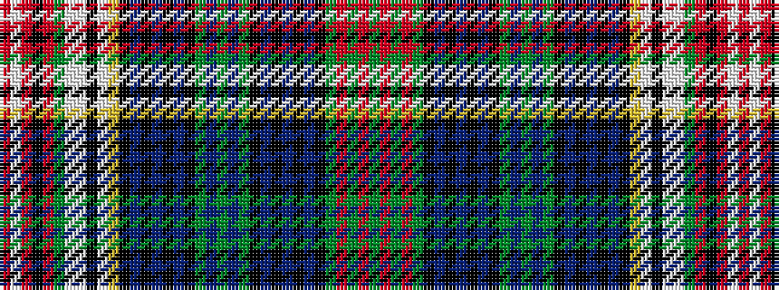

GRGRGKBKBKBKGBGBGKBKBKBKYWKWWGRKRWR

It is a 35 stripe tartan.

<figure class="pat-woven">

<figcaption>idealised sample</figcaption>
</figure>

## Colour Sequence



## Tartans with this colour sequence

| Tartans |
|---------------|
| [Duke of Edinburgh](/setts/s35/dg84r6dg8r16dg14k8db6k2db6k2db6k2dg4t3dg16t3dg4k6db8k3db6k3db8k10ly3w3k3w3w3dg16r8k3r4w4r4/)|
||
