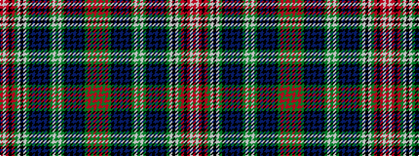

GRGRGKBKBKBKGWGWGKBKBKBKGWKWGRKRWR

It is a 34 stripe tartan.

<figure class="pat-woven">

<figcaption>idealised sample</figcaption>
</figure>

## Colour Sequence



## Tartans with this colour sequence

This pattern is a design lineage: every tartan below shares one colour order, whatever its owner —
near-identical designs are grouped, the largest lineage first (#112: the pattern is a tartan's
second parent, beside its family or clan).

<table class="sett-table">
<tbody>
<tr><td><a href="/variants/s34/dg84r6dg8r16dg14k8db6k2db6k2db6k2dg4lb3dg16lb3dg4k6db8k3db6k3db8k10y3w3k3w6dg16r8k3r4w4r4/">Duke of Edinburgh (Fashion)</a></td></tr>
<tr><td class="sett-swatch"></td></tr>
</tbody>
</table>

