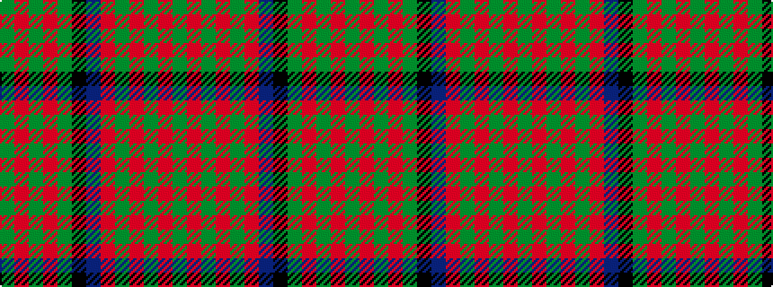

GRGRGKBRGRGRG

It is a 13 stripe tartan.

<figure class="pat-woven">

<figcaption>idealised sample</figcaption>
</figure>

## Colour Sequence



## Tartans with this colour sequence

| Tartans |
|---------------|
| [Barbecue Presbyterian Church](/variants/s13/dg17r2dg2r5dg29r2db31k2g29r5g2r2g17~x2/)|
||
