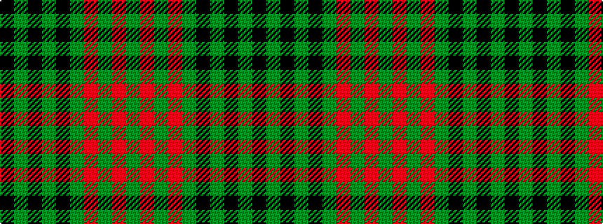

GRGRGKGKGK

It is a 10 stripe tartan.

<figure class="pat-woven">

<figcaption>idealised sample</figcaption>
</figure>

## Colour Sequence



## Tartans with this colour sequence

| Tartans |
|---------------|
| [City of Armadale](/variants/s10/k21g2k2g2k3g15r29g2r2g4~x2/)|
||
