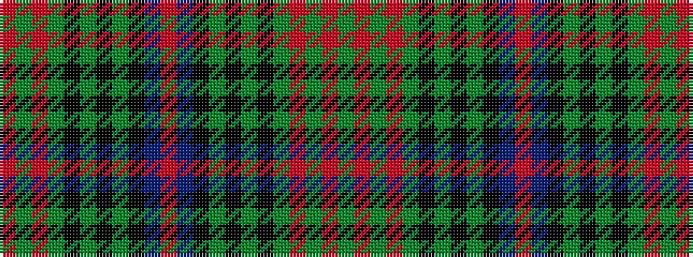

GRGRGKGKGKBRBKGKGKGRGR

It is a 22 stripe tartan.

<figure class="pat-woven">

<figcaption>idealised sample</figcaption>
</figure>

## Colour Sequence



## Tartans with this colour sequence

| Tartans |
|---------------|
| [Park Clan/Family Weavers Tartan](/variants/s22/r3db16k16g4k2g2k2g34r4g3r2g3~x2/)|
||
