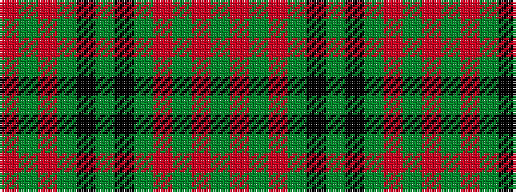

GRGRGKGKGRGR

It is a 12 stripe tartan.

<figure class="pat-woven">

<figcaption>idealised sample</figcaption>
</figure>

## Colour Sequence



## Tartans with this colour sequence

| Tartans |
|---------------|
| [Drummond](/variants/s12/r4g1r1g18k1g1k1g8r28g1r1g4~x2/)|
||
| [Drummond #3](/variants/s12/dg4r1dg1r28dg8k1dg1k1dg18r1dg1r4~x2/)|
||
