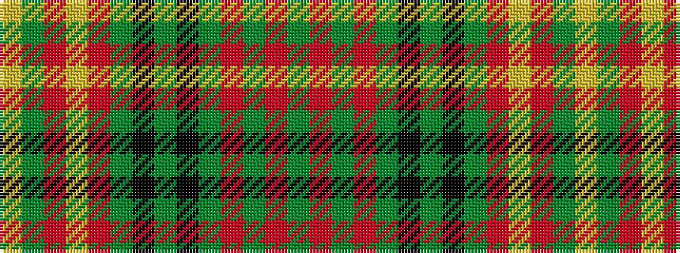

GRGRGKGKGRYRGY

It is a 14 stripe tartan.

<figure class="pat-woven">

<figcaption>idealised sample</figcaption>
</figure>

## Colour Sequence



## Tartans with this colour sequence

| Tartans |
|---------------|
| [Balnagowan (Harrods)](/variants/s14/ly3dy3r1ly2r1dy20k5dy4k5dy3r2dy3o7dy2~x2/)|
||
