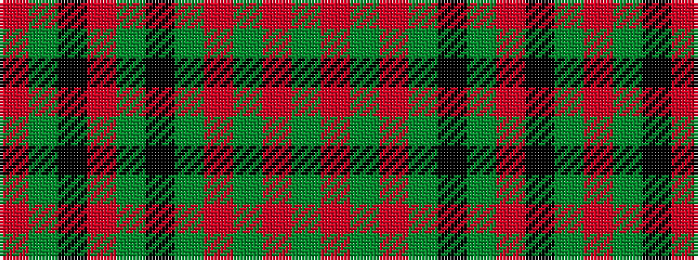

GRGRGKGRKGR

It is a 11 stripe tartan.

<figure class="pat-woven">

<figcaption>idealised sample</figcaption>
</figure>

## Colour Sequence



## Tartans with this colour sequence

| Tartans |
|---------------|
| [MacNeish Htg](/setts/s11/r6g3k3o24g4k10g4r2g24r6g2~x2/)|
||
