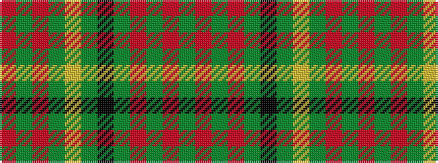

GRGRGKGYGRGR

It is a 12 stripe tartan.

<figure class="pat-woven">

<figcaption>idealised sample</figcaption>
</figure>

## Colour Sequence



## Tartans with this colour sequence

| Tartans |
|---------------|
| [Quinn (Name?)](/setts/s12/r20g5r5g30ly8g10k10g30r5g5r20g20~x2/)|
||
