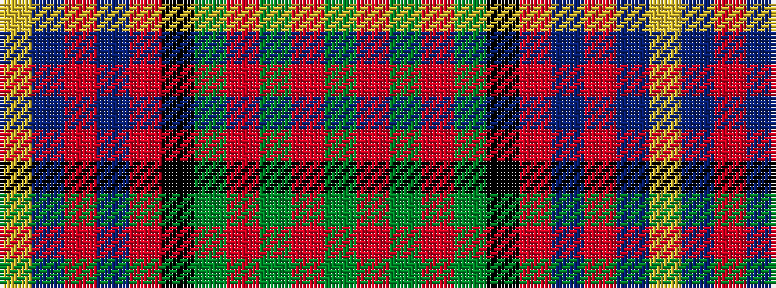

GRGRGKRBRBY

It is a 11 stripe tartan.

<figure class="pat-woven">

<figcaption>idealised sample</figcaption>
</figure>

## Colour Sequence



## Tartans with this colour sequence

| Tartans |
|---------------|
| [Cameron of Erracht](/setts/s11/dg8r1dg1r3dg16k16r1db16r3db8ly2/)|
||
| [Cameron of Erracht](/setts/s11/dg8r1dg1r3dg16k16r1db16r3db8ly2~x2/)|
||
| [Cameron of Erracht (Clan)](/setts/s11/g8r1g1r3g16k16r1db16r3db8ly2~x2/)|
||
