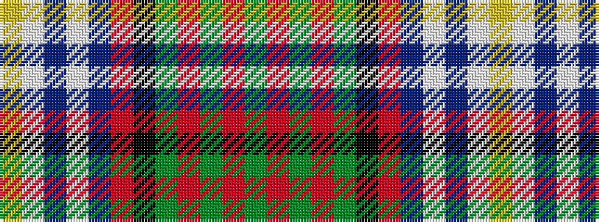

GRGRGKRBWBWY

It is a 12 stripe tartan.

<figure class="pat-woven">

<figcaption>idealised sample</figcaption>
</figure>

## Colour Sequence



## Tartans with this colour sequence

| Tartans |
|---------------|
| [McGuirk (2013)](/variants/s12/dg4r1dg1r3dg16k12r1db27lb2db3lb1ly2~x2/)|
||
