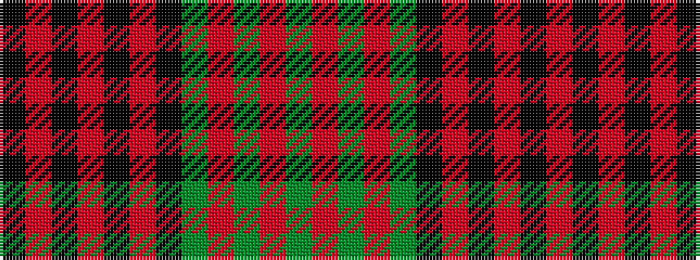

GRGRGKRKRKRK

It is a 12 stripe tartan.

<figure class="pat-woven">

<figcaption>idealised sample</figcaption>
</figure>

## Colour Sequence



## Tartans with this colour sequence

| Tartans |
|---------------|
| [MacDonald #8](/setts/s12/k6r1k1r4k7r1k7dg6r5dg1r1dg5~x2/)|
||
| [MacDonald 6](/setts/s12/k6r1k1r4k7r1k7g6r5g1r1g5~x2/)|
||
