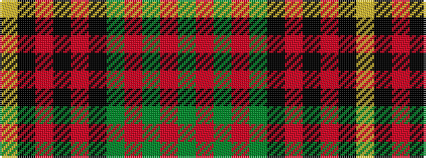

GRGRGKRKRKY

It is a 11 stripe tartan.

<figure class="pat-woven">

<figcaption>idealised sample</figcaption>
</figure>

## Colour Sequence



## Tartans with this colour sequence

| Tartans |
|---------------|
| [79th Regiment (Military)](/variants/s11/dg22r2dg2r6dg42ki46r2k42r6k12lo3/)|
||
