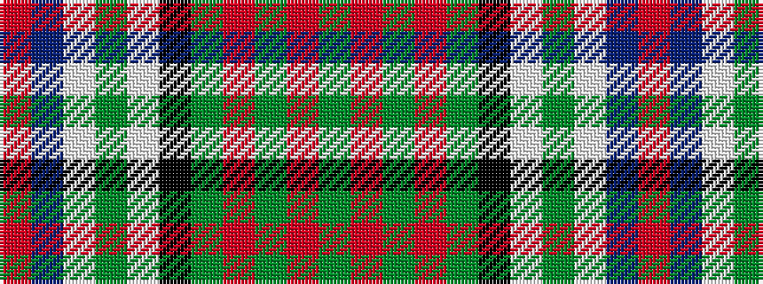

GRGRGKWGWBR

It is a 11 stripe tartan.

<figure class="pat-woven">

<figcaption>idealised sample</figcaption>
</figure>

## Colour Sequence



## Tartans with this colour sequence

| Tartans |
|---------------|
| [New York Caledonian Club Day](/setts/s11/g9o1g2r3g28k16lb1g8lb1db8r1~x2/)|
||
