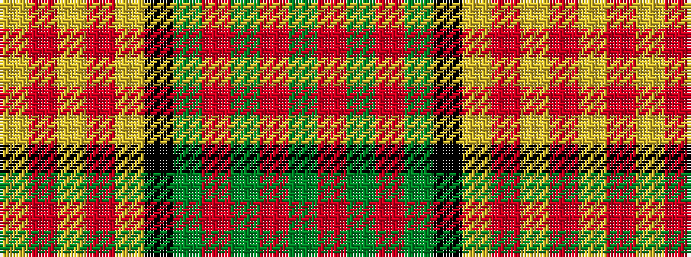

GRGRGKYRYRY

It is a 11 stripe tartan.

<figure class="pat-woven">

<figcaption>idealised sample</figcaption>
</figure>

## Colour Sequence



## Tartans with this colour sequence

| Tartans |
|---------------|
| [Glenmorangie (Corporate)](/setts/s11/y6m2y2m4y13k12lo13m4lo2m2lo6~x2/)|
||
