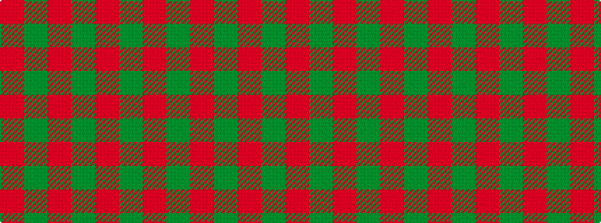

GRGRGR

It is a [6 stripe pattern](/stripes/stripes6/) — every 6-stripe pattern is gathered there.

<figure class="pat-woven">

<figcaption>idealised sample</figcaption>
</figure>

## Colour Sequence



## Tartans with this colour sequence

This pattern is a design lineage: every tartan below shares one colour order, whatever its owner —
near-identical designs are grouped, the largest lineage first (#112: the pattern is a tartan's
second parent, beside its family or clan).

<table class="sett-table">
<tbody>
<tr><td><a href="/tartans/e/er/erskine-2/">Erskine</a></td></tr>
<tr><td class="sett-swatch"></td></tr>
<tr><td><a href="/tartans/u/un/unidentified-nw-highlands/">Unidentified NW Highlands</a> <small class="dt">ΔTartan 0.67</small></td></tr>
<tr><td class="sett-swatch"></td></tr>
<tr><td><a href="/tartans/m/ma/macquarrie-7/">MacQuarrie 7</a> <small class="dt">ΔTartan 0.77</small></td></tr>
<tr><td class="sett-swatch"></td></tr>
<tr><td><a href="/tartans/m/ma/macquarie/">MacQuarie</a> <small class="dt">ΔTartan 0.81</small></td></tr>
<tr><td class="sett-swatch"></td></tr>
<tr class="cluster-sep"><td></td></tr>
<tr><td><a href="/tartans/c/ca/cameron-clan-d/">Cameron Clan D</a> <small class="dt">ΔTartan 1.70</small></td></tr>
<tr><td class="sett-swatch"></td></tr>
<tr><td><a href="/tartans/c/ca/cameron-4/">Cameron</a> <small class="dt">ΔTartan 1.78</small></td></tr>
<tr><td class="sett-swatch"></td></tr>
<tr><td><a href="/tartans/m/ma/maguire-2/">Maguire</a> <small class="dt">ΔTartan 2.00</small></td></tr>
<tr><td class="sett-swatch"></td></tr>
<tr class="cluster-sep"><td></td></tr>
<tr><td><a href="/tartans/h/ha/harmony-11-3/">Harmony, 11</a> <small class="dt">ΔTartan 10.11</small></td></tr>
<tr><td class="sett-swatch"></td></tr>
</tbody>
</table>

