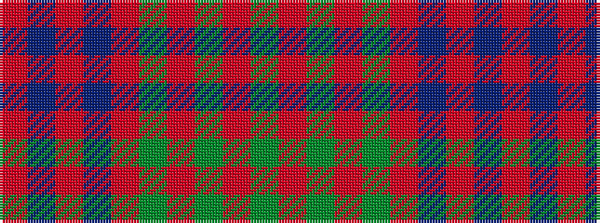

GRGRGRBRBR

It is a 10 stripe tartan.

<figure class="pat-woven">

<figcaption>idealised sample</figcaption>
</figure>

## Colour Sequence



## Tartans with this colour sequence

| Tartans |
|---------------|
| [Unidentified Plaid #15](/variants/s10/r4t3r32db30r4dg32r3dg32r3dg3~x2/)|
||
| [Unidentified Plaid 6](/variants/s10/r4t3r32db30r4g32r3g32r3g3~x2/)|
||
