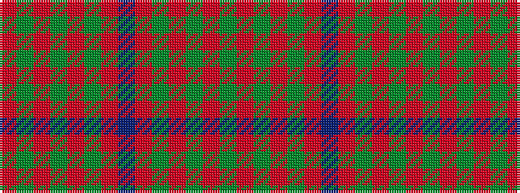

GRGRGRBRGRGRGR

It is a 14 stripe tartan.

<figure class="pat-woven">

<figcaption>idealised sample</figcaption>
</figure>

## Colour Sequence



## Tartans with this colour sequence

| Tartans |
|---------------|
| [MacColl #2](/variants/s14/r12dg1r1dy8r2dy1r1db3r1dy1r12dg1r1dg4~x2/)|
||
| [MacColl #3](/variants/s14/r12dy1r1dg8r2dy1r1db3r1dy1r12dg1r1dg4~x2/)|
||
