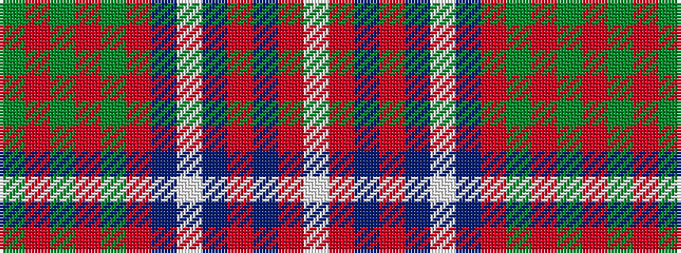

GRGRGRBWBRBRW

It is a 13 stripe tartan.

<figure class="pat-woven">

<figcaption>idealised sample</figcaption>
</figure>

## Colour Sequence



## Tartans with this colour sequence

| Tartans |
|---------------|
| [Ontario (Official)](/setts/s13/g19r1g2r2g15r1dt13w1db2r2db21r1w3~x2/)|
||
