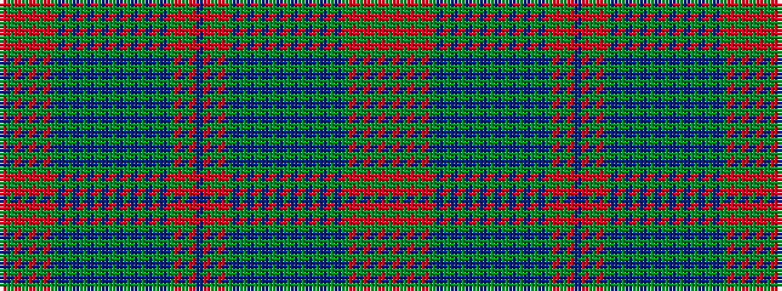

GRGRGRGBGBGBGBGBGBGBGBGRGRBRGRGBGBGBGBGBGBGBGBGRGRGRGR

It is a 54 stripe tartan.

<figure class="pat-woven">

<figcaption>idealised sample</figcaption>
</figure>

## Colour Sequence



## Tartans with this colour sequence

| Tartans |
|---------------|
| [Ross (Wilsons)](/variants/s54/r25g6r25g29r4g8r4g29dp32g6dp32g29dp2g2dp4g2dp2g29dp2g2dp4g2dp2g29r25g6r25dp2/)|
||
