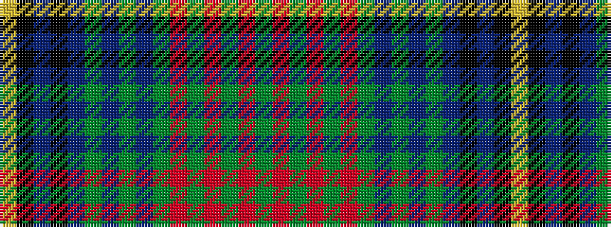

GRGRGRGBGBGBKBKY

It is a 16 stripe tartan.

<figure class="pat-woven">

<figcaption>idealised sample</figcaption>
</figure>

## Colour Sequence



## Tartans with this colour sequence

| Tartans |
|---------------|
| [Strathmore](/setts/s16/dg3r15dg2r2dg2r2dg18do2dg2do2dg2do27k2do2k6lo2~x2/)|
||
