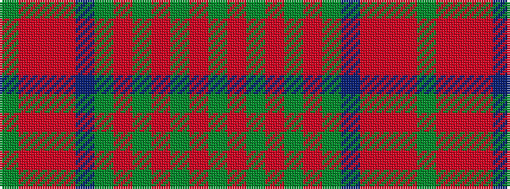

GRGRGRGBRRRG

It is a 12 stripe tartan.

<figure class="pat-woven">

<figcaption>idealised sample</figcaption>
</figure>

## Colour Sequence



## Tartans with this colour sequence

| Tartans |
|---------------|
| [Harmony 5](/setts/s12/g9r3g4o3g3o4g3dp11o30r3o4g3~x2/)|
||
