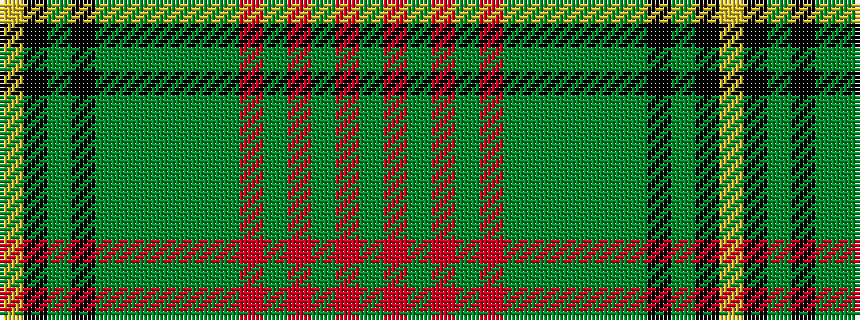

GRGRGRGGGGGGKGKY

It is a 16 stripe tartan.

<figure class="pat-woven">

<figcaption>idealised sample</figcaption>
</figure>

## Colour Sequence



## Tartans with this colour sequence

| Tartans |
|---------------|
| [Strathmore (District)](/variants/s16/g3r15gi2r2gi2r2gi18dy2gi2dy2gi2dy27k2dy2k6lo2~x2/)|
||
