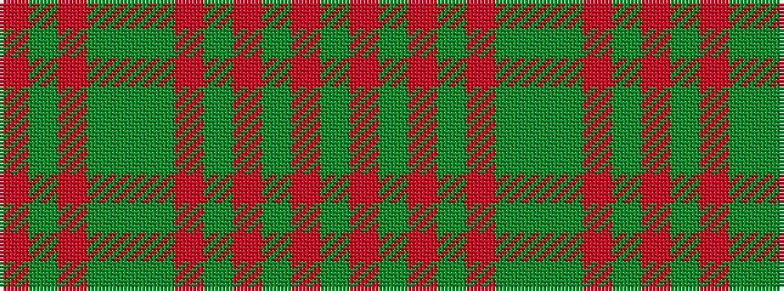

GRGRGRGGGRGR

It is a 12 stripe tartan.

<figure class="pat-woven">

<figcaption>idealised sample</figcaption>
</figure>

## Colour Sequence



## Tartans with this colour sequence

| Tartans |
|---------------|
| [Maple Leaf (District)](/variants/s12/r15g3r3g19dy6y6o6g19r3g3r15y13~x2/)|
||
