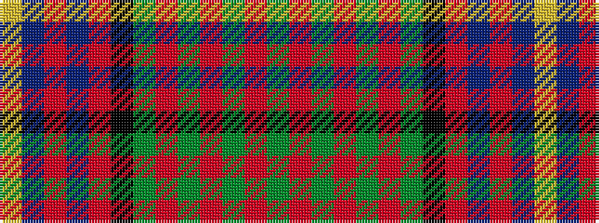

GRGRGRGKRBRBY

It is a 13 stripe tartan.

<figure class="pat-woven">

<figcaption>idealised sample</figcaption>
</figure>

## Colour Sequence



## Tartans with this colour sequence

| Tartans |
|---------------|
| [Cochrane (1974)](/setts/s13/dg22r4dg2r2dg2r4dg12k12r2db10r4db4ly3~x2/)|
||
| [Cochrane LC](/setts/s13/dg22r4dg2r2dg2r4dg12k12r2db10r4db4ly3/)|
||
| [Cochrane of Dundonald](/setts/s13/g44r4g2r2g2r4g12k12r2db10r4db4ly3~x2/)|
||
| [Cochrane, -1974](/setts/s13/g22r4g2r2g2r4g12k12r2db10r4db4ly3~x2/)|
||
