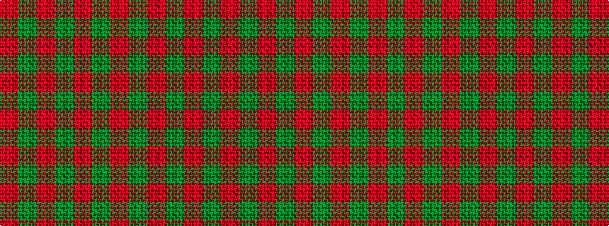

GRGRGRGR

It is a 8 stripe tartan.

<figure class="pat-woven">

<figcaption>idealised sample</figcaption>
</figure>

## Colour Sequence



## Tartans with this colour sequence

| Tartans |
|---------------|
| [Aukland & District Pipe Band (Corp)](/variants/s8/g164r20g6r20g23r14g4r36/)|
||
| [KaDeWe](/variants/s8/r100dg4r8dg18r3~x2/)|
||
| [Kyle Green (Name)](/variants/s8/r54g6r5g6r10g3r2g18~x2/)|
||
| [Menzies](/variants/s8/g48r4g2r4g6r2g3r9~x2/)|
||
| [Menzies Hunting](/setts/dg48r4dg2r4dg6r2dg3r9/)|
||
