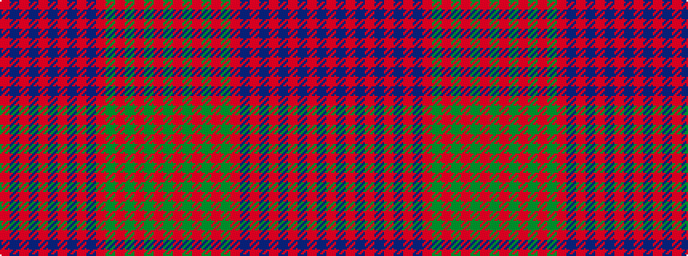

GRGRGRGRBRBRBRBRBR

It is a 18 stripe tartan.

<figure class="pat-woven">

<figcaption>idealised sample</figcaption>
</figure>

## Colour Sequence



## Tartans with this colour sequence

This pattern is a design lineage: every tartan below shares one colour order, whatever its owner —
near-identical designs are grouped, the largest lineage first (#112: the pattern is a tartan's
second parent, beside its family or clan).

<table class="sett-table">
<tbody>
<tr><td><a href="/variants/s18/r18db2r1db2r1db1r18db18r2db18r18g2r4g2r18g18r2g9~x2/">MacTier of Durris</a></td></tr>
<tr><td class="sett-swatch"></td></tr>
<tr><td><a href="/variants/s18/r18db1r1db2r1db1r18db18r2db18r18dg2r4dg2r18dg18r2dg9~x4/">MacTier of Durris</a></td></tr>
<tr><td class="sett-swatch"></td></tr>
<tr><td><a href="/setts/r18db1r1db2r1db1r18db18r2db18r18g2r4g2r18g18r2g9/">Ross</a></td></tr>
<tr><td class="sett-swatch"></td></tr>
<tr><td><a href="/variants/s18/r18db1r1db2r1db1r18db18r2db18r18g2r4g2r18g18r2g18~x2/">Ross #5</a></td></tr>
<tr><td class="sett-swatch"></td></tr>
</tbody>
</table>

