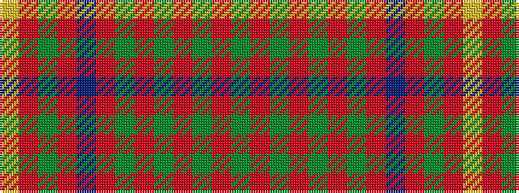

GRGRGRGRBRGRY

It is a 13 stripe tartan.

<figure class="pat-woven">

<figcaption>idealised sample</figcaption>
</figure>

## Colour Sequence



## Tartans with this colour sequence

| Tartans |
|---------------|
| [Unidentified Plaid #4](/setts/s13/ly18r18dg30r12db55r42dg6r18dg6r42dg44r12dg12/)|
||
| [Unidentified Plaid 16](/setts/s13/ly18r18dg30r12db55r42dg6r18dg6r42g44r12dg12/)|
||
