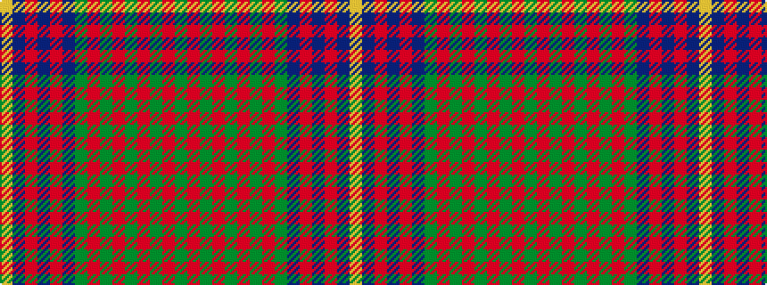

GRGRGRGRGBRBRBY

It is a 15 stripe tartan.

<figure class="pat-woven">

<figcaption>idealised sample</figcaption>
</figure>

## Colour Sequence



## Tartans with this colour sequence

| Tartans |
|---------------|
| [Cochrane Hunting](/variants/s15/g46r6g6r2g8r2g6r2g6dr36r2db47r6db24ly6/)|
||
