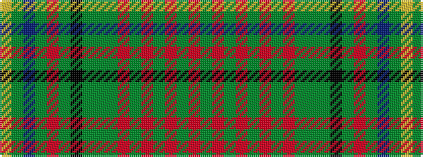

GRGRGRGRGGGKGRGBGY

It is a 18 stripe tartan.

<figure class="pat-woven">

<figcaption>idealised sample</figcaption>
</figure>

## Colour Sequence



## Tartans with this colour sequence

| Tartans |
|---------------|
| [Ben Murad (Personal)](/setts/s18/dg18r3dg3r15dy13r14dg3r3dg18dy5dg2k5dg3r2dg3db5dg2lg5~x2/)|
||
