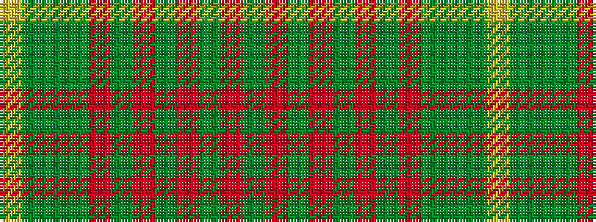

GRGRGRGRGGGY

It is a 12 stripe tartan.

<figure class="pat-woven">

<figcaption>idealised sample</figcaption>
</figure>

## Colour Sequence



## Tartans with this colour sequence

| Tartans |
|---------------|
| [Maple Leaf MINI Canadian District Tartan Tartan Number: 20355. Earliest known date: 1964 Generated for Dupion Silk List for display purpose. See products available Copyright © Blair Urquhart, Comrie, 2015](/tartans/dg6m1dg1m4g4m4dg1m1dg6dy2g2ly2/)|
||
